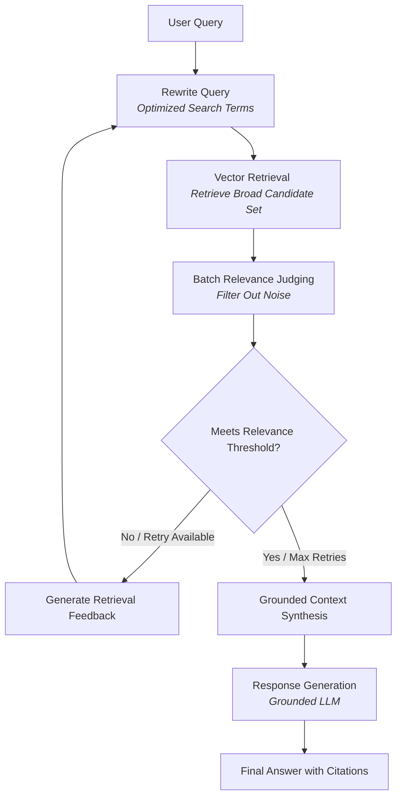

# 💡 InsightLM

InsightLM is a highly polished document intelligence workspace inspired by NotebookLM. It allows you to upload PDFs and plain text files, chat with your documents to get grounded answers, and seamlessly jump to cited pages using an integrated in-app document viewer.


---

## 🏗️ Tech Stack & Architecture

* **Client**: Next.js (React 19), Tailwind CSS, Server-Sent Events (SSE) streaming, PDF viewer integration.
* **Backend**: Express.js API, PDF & TXT parsing, multi-stage RAG orchestrator (`ragService.js`).
* **Vector Database**: Qdrant (highly efficient vector similarity search with metadata filtering).
* **AI Embeddings**: `BAAI/bge-large-en-v1.5` via Hugging Face.
* **Generative Models**:
  * **Answer Model**: `Qwen/Qwen2.5-7B-Instruct`
  * **Query / Judge Models**: Configurable (defaults to the main chat model or specialized smaller instruction models like `Qwen/Qwen2.5-1.5B-Instruct` for speed).

---

## 🚀 Key Highlights & New Features

### 🔍 Corrective Retrieval-Augmented Generation (CRAG)
* **Intelligent Query Rewriting**: Each user query is rewritten using a query model to optimize search terminology, resolve typos, and inject relevant technical synonyms before Qdrant vector retrieval.
* **Broad Candidate Retrieval**: Retrieves a wider set of candidate chunks (multiplied retrieval target) to ensure maximum coverage of potential answers.
* **Batch Relevance Judging**: Processes and evaluates the relevance of chunks in parallel batches using a dedicated LLM judge, weeding out noise and filler text.
* **Adaptive Retry with Feedback**: If the initial retrieval results are weak or irrelevant, the pipeline automatically retries once, feeding specific retrieval feedback back into the query rewriter.

### 🛡️ Tightened Grounding & Guardrails
* **Conv-to-Fact Isolation**: Chat history is treated as conversational context only. The model does not treat historical conversation statements as factual evidence unless they are grounded in the uploaded document.
* **Grounded Answer Prompts**: The answer prompt strictly instructs the generative model to answer *only* from the retrieved context, returning clean markdown with inline page-level citations.

---

## 📊 Pipeline Flow

### System Flow Diagram


---

## 📂 Project Structure

```text
├── backend/
│   ├── index.js             # Entry point & server configuration
│   ├── routes/              # Express API endpoints (upload, chat, documents)
│   ├── services/            # Core logic (ragService.js, embeddingService.js, pdfService.js)
│   └── utils/               # Helper utilities (chunking, promptTemplates.js, fileUtils.js)
│
├── client/
│   ├── app/                 # Next.js app router (layouts, styling, main page)
│   ├── components/          # Reusable UI (Sidebar, FileUpload, ChatInterface, DocumentViewer)
│   └── lib/                 # API clients & configuration
```

---

## ⚙️ Configuration & Environment Variables

Create a `.env` file in the `backend/` directory to configure the services:

### Primary System Configuration
| Variable | Required | Default | Description |
| :--- | :---: | :--- | :--- |
| `HF_TOKEN` | ✅ | - | Hugging Face Access Token for Embeddings & Inference |
| `QDRANT_URL` | ✅ | `http://localhost:6333` | Connection URL for Qdrant Vector DB |
| `QDRANT_API_KEY` | ❌ | - | API key for protected Qdrant instances |
| `QDRANT_COLLECTION_NAME` | ❌ | `insightlm-docs` | Target vector collection name |
| `PORT` | ❌ | `8000` | Port the backend runs on |
| `FRONTEND_URL` | ❌ | `http://localhost:3000` | Allowed CORS origin |

### CRAG Engine Tuning Knobs
| Variable | Required | Default | Description |
| :--- | :---: | :--- | :--- |
| `RAG_ANSWER_MODEL` | ❌ | `Qwen/Qwen2.5-7B-Instruct` | Large LLM model used for final response generation |
| `RAG_QUERY_MODEL` | ❌ | *(Same as Answer)* | Small/medium model for query rewriting |
| `RAG_JUDGE_MODEL` | ❌ | *(Same as Answer)* | Model used to evaluate chunk relevance |
| `RAG_TOP_K` | ❌ | `8` | Desired final chunk count |
| `RAG_CANDIDATE_MULTIPLIER`| ❌ | `2` | Fetch multiplier to retrieve candidate pool (e.g., fetch 16) |
| `RAG_MAX_REWRITE_ATTEMPTS`| ❌ | `2` | Maximum retry attempts for the rewrite-retrieval loop |
| `RAG_MIN_RELEVANT_CHUNKS` | ❌ | `2` | Minimum relevant chunks required before triggering a retry |
| `RAG_JUDGE_BATCH_SIZE` | ❌ | `8` | Number of chunks evaluated in a single LLM call |
| `RAG_MAX_CONTEXT_CHUNKS` | ❌ | `6` | Max chunks passed to the final answer generation context |

---

## 📡 API Endpoints Reference

| Method | Endpoint | Description |
| :--- | :--- | :--- |
| **`POST`** | `/api/upload` | Upload and parse document (`PDF` / `TXT`). Generates embeddings and writes to Qdrant. |
| **`POST`** | `/api/chat` | Main query endpoint. Initiates the CRAG pipeline and streams markdown via Server-Sent Events (SSE). |
| **`GET`** | `/api/documents` | Retrieve a list of all currently active documents. |
| **`GET`** | `/api/documents/:id/file` | Streams raw file content to feed the in-app document viewer. |
| **`DELETE`**| `/api/documents/:id` | Purges the file from memory and deletes all associated vectors from Qdrant. |
| **`GET`** | `/api/health` | Diagnostic endpoint checking backend status. |

---

## 🚀 Getting Started (Local Development)

### 1) Run Qdrant Vector Database
The vector search engine needs to be running. The easiest way is using Docker:
```bash
docker run -p 6333:6333 qdrant/qdrant
```

### 2) Setup and Run the Backend
1. Navigate to the backend directory:
   ```bash
   cd backend
   ```
2. Install dependencies:
   ```bash
   npm install
   ```
3. Create your `backend/.env` file using the configuration schema above.
4. Launch the developer server:
   ```bash
   npm run dev
   ```
   *The backend will run on `http://localhost:8000`.*

### 3) Setup and Run the Client (Next.js)
1. Navigate to the client directory:
   ```bash
   cd client
   ```
2. Install dependencies:
   ```bash
   npm install
   ```
3. Set your environment variables (optional: `NEXT_PUBLIC_API_URL` defaults to `http://localhost:8000/api`).
4. Start the frontend developer server:
   ```bash
   npm run dev
   ```
   *Open `http://localhost:3000` in your browser to view the application.*

---

## ⚠️ Notes & Current Limitations
* **In-Memory Document Index**: While chunk embeddings persist in Qdrant, metadata and file buffers are kept in-memory on the backend server (`documentStore`). If the Node backend restarts, you will need to re-upload files to sync the frontend document sidebar (though the vector store stays populated).
* **Direct Memory File Serving**: The document viewer displays documents by streaming file buffers directly from the server's memory (`/api/documents/:id/file`).
